# Project Instructions

# Optimization of the Water Pump Portfolio and Seasonality Analysis for Sales Maximization

### Business Context:
- A water pump manufacturing company is facing challenges in managing its product portfolio and planning its production. The commercial management needs to better understand sales behavior to make strategic decisions regarding:

1. Which products maintain consistent performance;
2. Whether there is seasonality in sales;
3. How to optimize the product mix.

### Business Problem:
The company needs to reduce operational costs and increase profit margin through better production planning and inventory management. Currently, there are problems with:

1. Excess inventory of some models;
2. Stockouts in others;
3. Difficulty in forecasting demand;
4. Possibly non-optimized product mix.

### Business Questions to be Answered:

1. Is there seasonality in the sales of different product groups?
2. Which products are most relevant in terms of revenue?
3. How is the distribution of sales behaving among the different product groups?
4. Are there products with a trend of growth or decline in sales?
5. What is the correlation between the quantity sold and the revenue value per product group?

### Project Objectives:

1. Perform exploratory data analysis;
2. Identify seasonality patterns;
3. Segment products by performance;
4. Create visualizations that support decision-making.

### Propose data-driven recommendations for portfolio optimization
Expected Impact:

1. 15% reduction in inventory costs;
2. 10% increase in profit margin;
3. 20% improvement in production planning accuracy;
4. 30% reduction in stockouts.

### Deliverables:

1. Interactive dashboard with key KPIs;
2. Trend and seasonality analysis;
3. Product segmentation by performance;
4. Data-driven strategic recommendations.

### Complete project documentation
This problem is interesting for a portfolio because:

1. It demonstrates exploratory analysis capability;
2. It works with temporal data;
3. It has practical business application;
4. It allows showcasing visualization skills;
5. It has the potential for the use of different analytical techniques.

## Exploratory Data Analysis (EDA)
- In the picture below, one can notice that the **'MOTOBOMBA_APP'** group code possesses by far the largest amount of items sold, followed by 'MOTOBOMBA_AP' and 'MOTOBOMBA_AD'. This point out that there is just enoguh data to model the 'MOTOBOMBA_APP' group code.

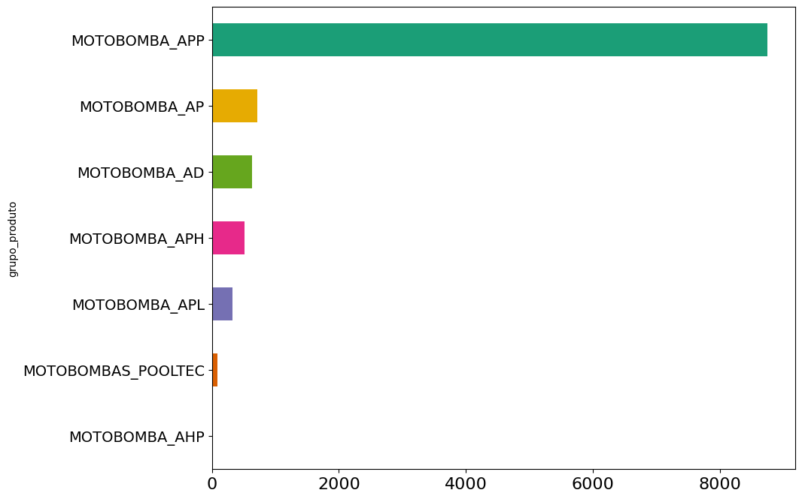

- From the picture below, one can notice the distribution of the items sold follows an exponential distribution, while the distribution of items order return is unspecified.

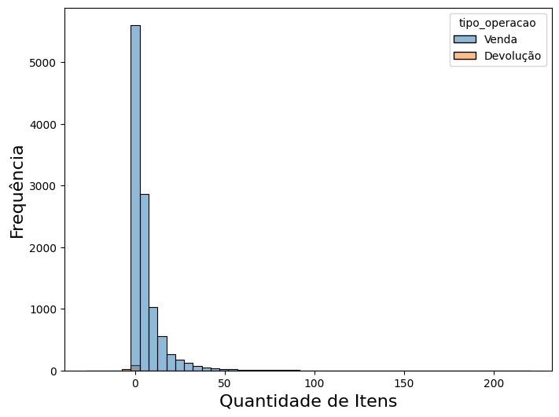

The picture below show the amount of items sold and orders returned for each group code, from which one can notice that **MOTOBOMBA_APP** has the largest amount of items sold and orders returned, followed by MOTOBOMBAS_POOLTEC, and MOTOBOMBA_AD.

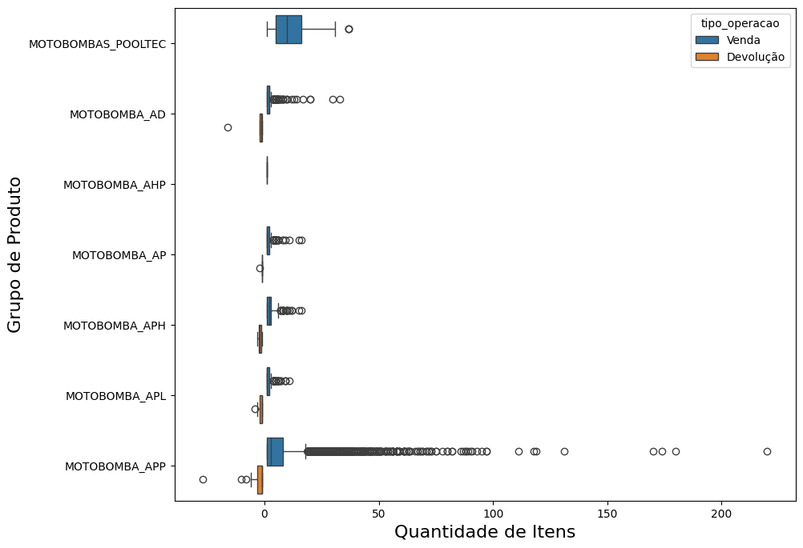

- From the three pictures below, one can notice that the largest amount of sold items were 2018 and 2019, followed by a decrease, maybe due to the pandemics.

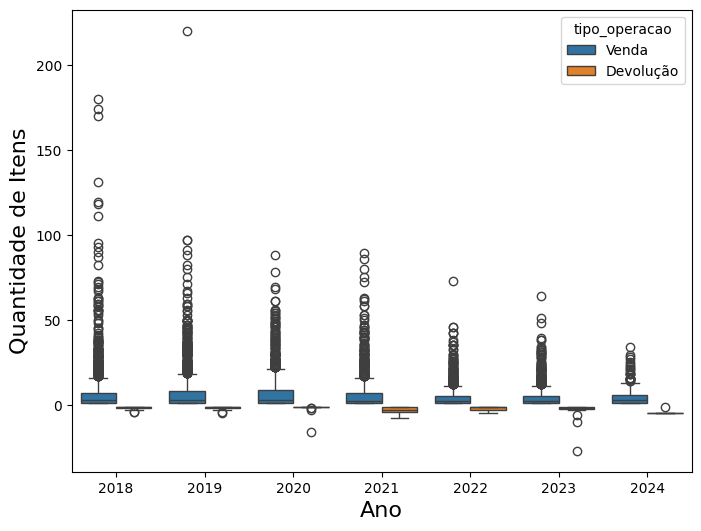

- From the picture below, one can notice that on November and December have an increase in the amount of items sold, followed by a decrease in January.

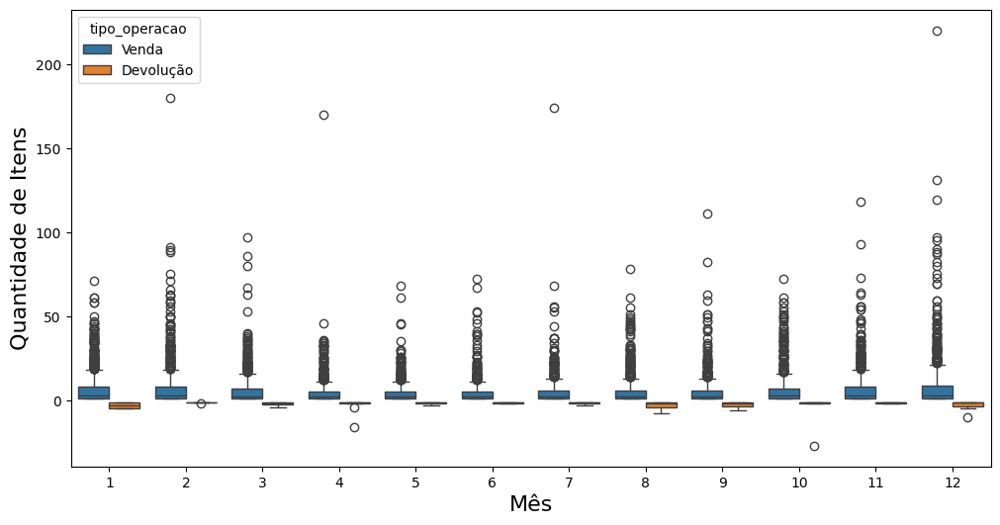

- One can notice that from the picture below for the first three quarters, the amount of sold items was similar, but for the last quarter there was an increase in the trend, as can be evidenced in the boxplot and violinplot above.

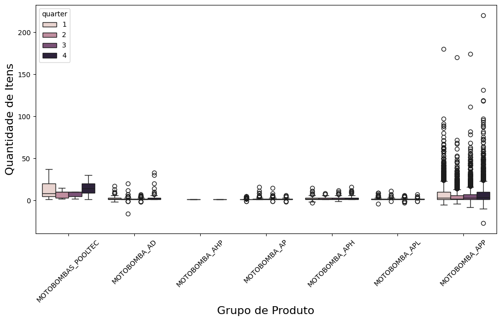

- Inspecting the correlation map below, one can notice that the features have a weak correlation between them.

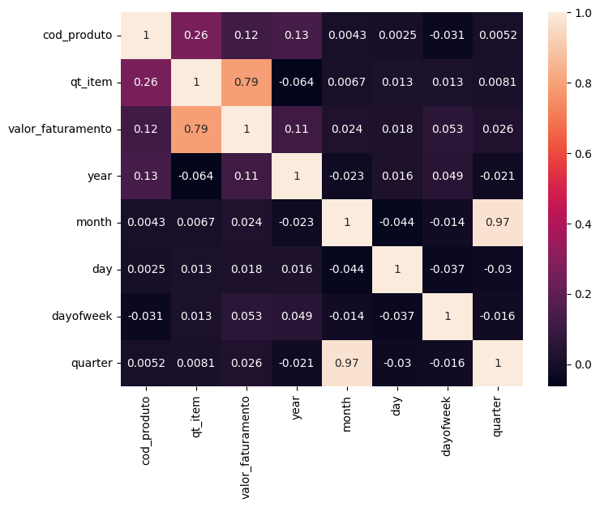

### **Summary of the main EDA Findings**

1. 'MOTOBOMBA_APP' group code is by far the group code that can be considered for further modeling analysis, due to the fact that it has much more data available than the other groups.
2. There is no weekend data in this dataset.
3. There are much more sold items than items order return, then the last one should be dropped out of the data.
4. Items are in general much more sold on November and December, followed by a decrease trend on January.
5. At 2018, 2019 there have been the largest amount of items sold in this database, followed by a decrease that might be related to the COVID-19 pandemics.
6. According to the correlation matrix, there are very weakly correlated features in this dataset.

## Time-Series Machine Learning Modeling

The following figure shows the prediction by using *ARIMA* modeling for time-series, from which it is clear that the ARIMa models do not work reasonably well on this data.

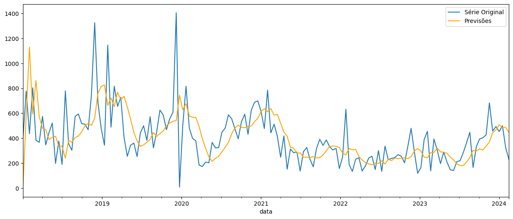

The picture below shows the predictions of a **XG Boost** regressor in the testing set, which displayed an *accuracy* of **88.02%**, evidencing a great fitting to the data.

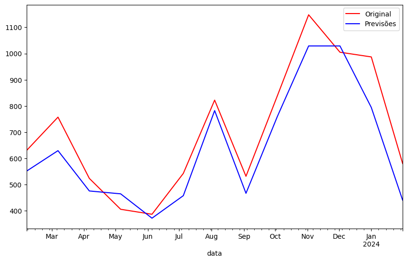

For the above XG Boost regressor, the picture below shows the importance of features to the overall predictions of the model. One can notice that two rolling mean related features are the most important ones.

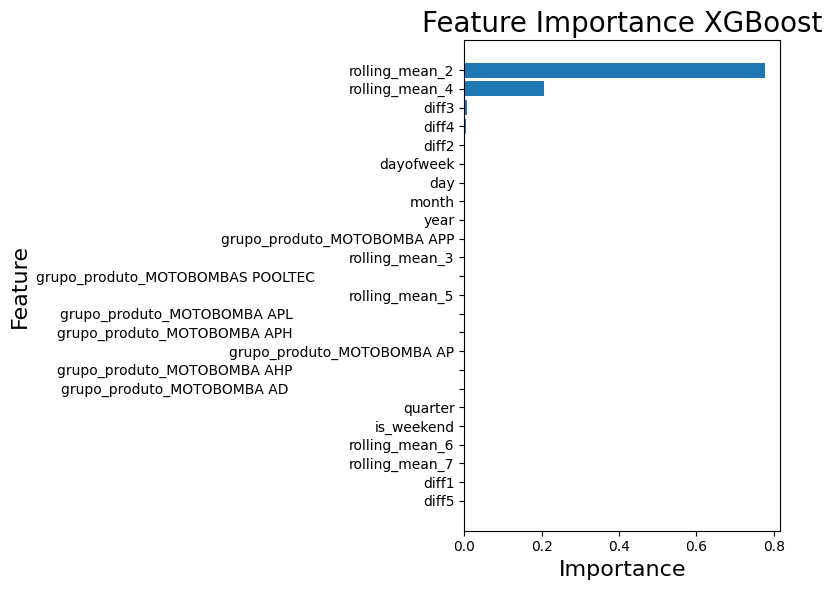

The picture below shows the predictions of a **Random Forest** regressor in the testing set, which displayed an *accuracy* of **91.69%**, evidencing a great fitting to the data.

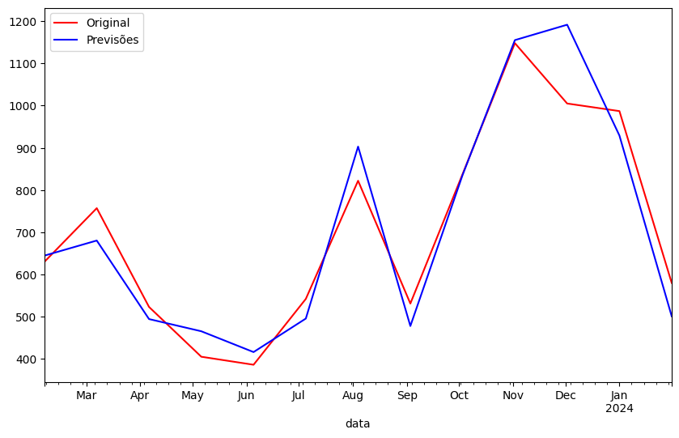

For the above Random Forest regressor, the picture below shows the importance of features to the overall predictions of the model. One can notice that rolling mean related features are the most important ones.

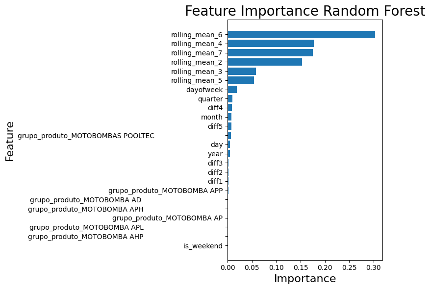

Finally, the picture below shows the predictions on the testing set for the "normal" way (as it was performed previously - red line) and for the iterative approach (it uses the current prediction as a feature for the next one - green line). Interestingly, the iterative approach has an almost perfect agreement to the testing data until November 2023, while the "normal" approach does not fit so well in the beginning, but after November 2023 it still keep yielding good results.

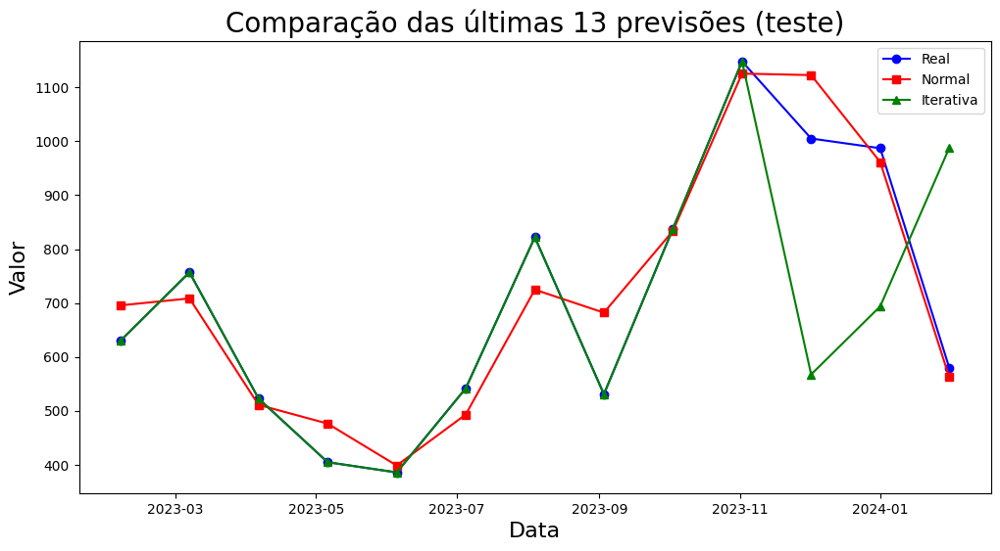

## Summary of the main ML Forecasting Findings

1. **Random Forest** was shown to be the best model, having presented an accuracy on the testing data above **91%**.
2. Rolling mean related features are the most predictive features for both Random Forest and XG Boost models.
3. ARIMA models seem to not work reasonably well on this data.

# MIT License

Copyright (c) [2025] [Dr. Vagner Zeizer Carvalho Paes]

Permission is hereby granted, free of charge, to any person obtaining a copy of this software and associated documentation files (the "Software"), to deal in the Software without restriction, including without limitation the rights to use, copy, modify, merge, publish, distribute, sublicense, and/or sell copies of the Software, and to permit persons to whom the Software is furnished to do so, subject to the following conditions:

The above copyright notice and this permission notice shall be included in all copies or substantial portions of the Software.

THE SOFTWARE IS PROVIDED "AS IS", WITHOUT WARRANTY OF ANY KIND, EXPRESS OR IMPLIED, INCLUDING BUT NOT LIMITED TO THE WARRANTIES OF MERCHANTABILITY, FITNESS FOR A PARTICULAR PURPOSE AND NONINFRINGEMENT. IN NO EVENT SHALL THE AUTHORS OR COPYRIGHT HOLDERS BE LIABLE FOR ANY CLAIM, DAMAGES OR OTHER LIABILITY, WHETHER IN AN ACTION OF CONTRACT, TORT OR OTHERWISE, ARISING FROM, OUT OF OR IN CONNECTION WITH THE SOFTWARE OR THE USE OR OTHER DEALINGS IN THE SOFTWARE.